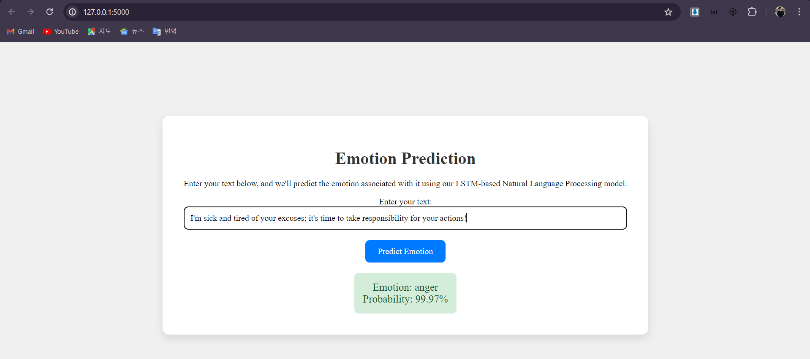
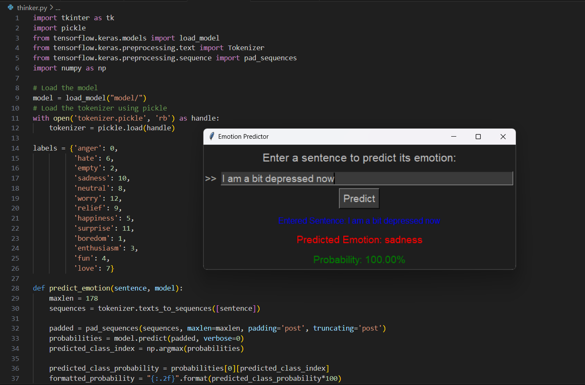

# EmoDetectNLP

EmoDetectNLP is a project aimed at emotion detection in text using Long Short-Term Memory (LSTM) neural networks. It includes both a desktop application built with Tkinter and a web application built with Flask.

## Development Process
The development of EmoDetectNLP involved several key steps:

1. **Data Preprocessing**: The textual data was preprocessed, including tokenization, padding, and embedding.
2. **Model Architecture**: An LSTM neural network architecture was chosen for its ability to capture long-range dependencies in text data. This was implemented using TensorFlow.
3. **Training**: The model was trained using a dataset containing labeled examples of text and associated emotions (100% accuracy).
4. **Evaluation**: The trained model was evaluated on a separate validation dataset to assess its performance.
5. **Integration**: The trained model was integrated into both a desktop application using Tkinter and a web application using Flask for real-time emotion prediction.

## Installation
To install and run the Tkinter and Flask applications, follow these steps:

### Tkinter/Flask App

```bash
# Clone the repository
git clone https://github.com/mirsaidl/EmoDetectNLP.git
cd EmoDetectNLP

# Install dependencies
pip install -r requirements.txt

# Run the Tkinter app
python tkinter-app.py

# Run Flask app
python flask-app.py # follow local-host link
```

## Dataset Information

The dataset used for training EmoDetectNLP contains labeled examples of text data along with their associated emotions. The emotions are classified into several classes which are:
Anger, Happiness, Sadness, Neutral, Surprise, Boredom, Fun, Enthusiasm, Relief, Love, Worry, Hate, Empty

## Dataset Importance

The emotion dataset is crucial for training the model to accurately predict emotions in text data. It provides the necessary labeled examples for the model to learn the relationship between text inputs and their corresponding emotions.

### Preview of Web-Pages and Apps

Flask app


video link: [LINK](https://drive.google.com/file/d/12Y5o11ofrY8RPqNb3jQuzbhVFWJjz1Q3/view?usp=sharing)

Tkinter app


